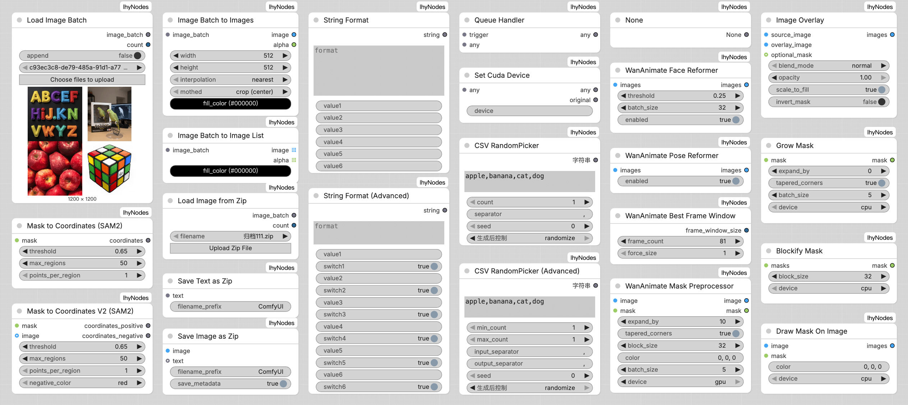

#
<p align="center">

<h1 align="center">ComfyUI-lhyNodes</h1>
<h3 align="center">Welcome to my ComfyUI efficiency node suite<br>[<a href="./README_zh.md">📃中文版</a>]
</p>
<p align="center">
<picture>
  <source media="(prefers-color-scheme: dark)" srcset="./res/img/preview_dark.png">
  <source media="(prefers-color-scheme: light)" srcset="./res/img/preview.png">
  
</picture>
</p>

## Installation

You can:

⭐️ Search for `lhyNodes` in `ComfyUI-Manager` and install it.

or

- Install it manually in command line:

	```bash
  cd ComfyUI/custom_nodes
  git clone https://github.com/lihaoyun6/ComfyUI-lhyNodes.git
  python -m pip install -r ComfyUI-lhyNodes/requirements.txt
  ``` 

## Nodes

### Load Image Batch
> Upload multiple images directly through the browser and generate a image batch or image list.

### Image Batch to Images
> Convert the `image_batch` object into a batch of images.

### Image Batch to Image List
> Convert the `image_batch` object into a list of images.

### Load Image from ZIP
> Read images from uploaded zip file and generate `image_batch` object.

### Save Image as ZIP
> Save the image (with optional additional text) as a ZIP file and provide it for download.

### String Format
> Format and output the text containing placeholders `{}` according to the variables.

### String Format (Advanced)
> Format and output the text containing placeholders `{}` according to the variables.  
> And you can enable or disable any variable.

### CSV Random Picker
> Randomly select elements from a CSV string by seed.

### CSV Random Picker (Advanced)
> Randomly select elements from a CSV string by seed with more options.

### Queue Handler
> Use triggers to control when any node executes.

### None
> Do nothing, just output `None`

### Set CUDA Device
> Modify the value of the environment variable `CUDA_VISIBLE_DEVICES` during runtime.

### Image Overlay
> Overlay an image onto another image.

### Grow Mask
> Growing input masks extremely fast.

### Blockify Mask / Draw Mask On Image
> Just like their names.

### WanAnimate Mask Preprocessor
> All-in-one Wan Animate mask preprocessor.

### WanAnimate Face Reformer
> Remove faceless frames from the facial frame sequence and restore its coherence.

### WanAnimate Pose Reformer
> Use it to remove all-black frames from any frame sequence and restore its coherence.

### WanAnimate Best Frame Window
> Calculate the optimal frame window size based on the total frames count.

### Mask to Coordinates
> Generate SAM conditions by drawing points in ComfyUI's Mask Editor.

### Mask to Coordinates V2
> Generate positive and negative SAM conditions using mask brush and colored brush.

## Credits
- [ComfyUI](https://github.com/comfyanonymous/ComfyUI) @comfyanonymous
